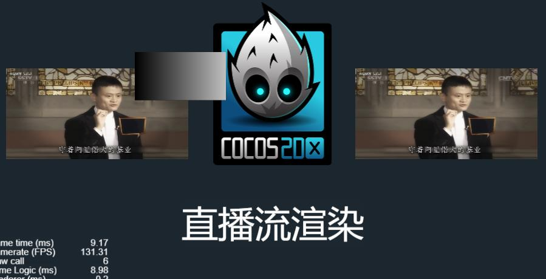
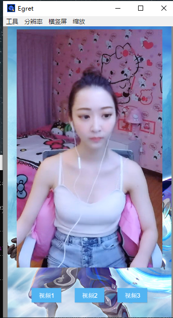

# 你必须有 node , ffmpeg  或 obs
## 01： Node-Media-Server 命令启动服务器： node app.js 或 双击 app_run.bat
## 02： 双击启动 mayun-推流.bat ffmpeg的推流
## 03：	启动客户端 填写好正确的flv视频流地址

#### Node-Media-Server   ---- 服务器-推送直播流
#### Egret_flv           ---- 白鹭引擎客户端-flv版本
#### Egret_nodePlay      ---- 白鹭引擎客户端-NodePlayer版本
#### flv                 ---- H5客户端-flv版本
#### hls                 ---- H5客户端-hls标签播放
#### NodePlayer          ---- H5客户端-NodePlayer版本
#### cocoscreator_nodeplay	---- cocos客户端-NodePlayer版本

#分享一个2018就开始接触的直播flv， 一个基于 nodepaly.js 兼容三端的插件
 

laya 白鹭 cocos 三个引擎2D 都玩过了· laya好多没有封装完也是坑， 白鹭好像被棋牌公司包了内部不对外开放更多文档，  最好的就是cocoscreator了！！

